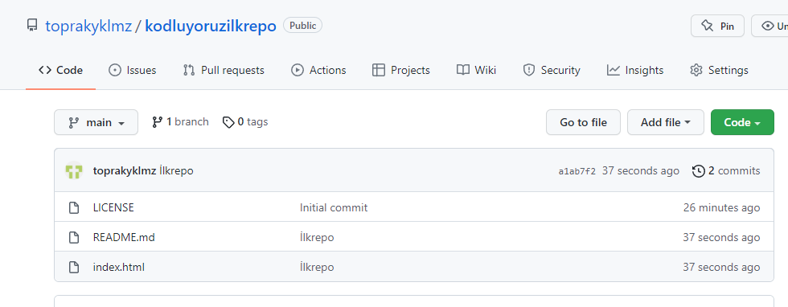

# KODLUYORUZ ILK REPO
[Kodluyoruz](https://www.kodluyoruz.org/) kapsamında açtığım ilk repo
içerisinde bir adet REAMDE dosyası bir adet de index.html dosyası barındırıyor.


# INSTALLATION

öncelikle projeyi clonelayın. (buraya kendi reponuzdan aldığınız link gelecek)

```
git clone https://github.com/toprakyklmz/kodluyoruzilkrepo
```

# USAGE

Projeyi klonladıktan sonra visual studio programında açınız.

Linux için :

 ```
 cd kodluyoruzilkrepo
 code  .
 ```

 # CONTRUBUTİNG

 Pull requestler kabul edilir. Büyük değişiklikler için, lütfen önce neyi değiştirmek istediğinizi tartışmak için konu açınız.

 # License

 [MIT](https://choosealicense.com/licenses/mit/)